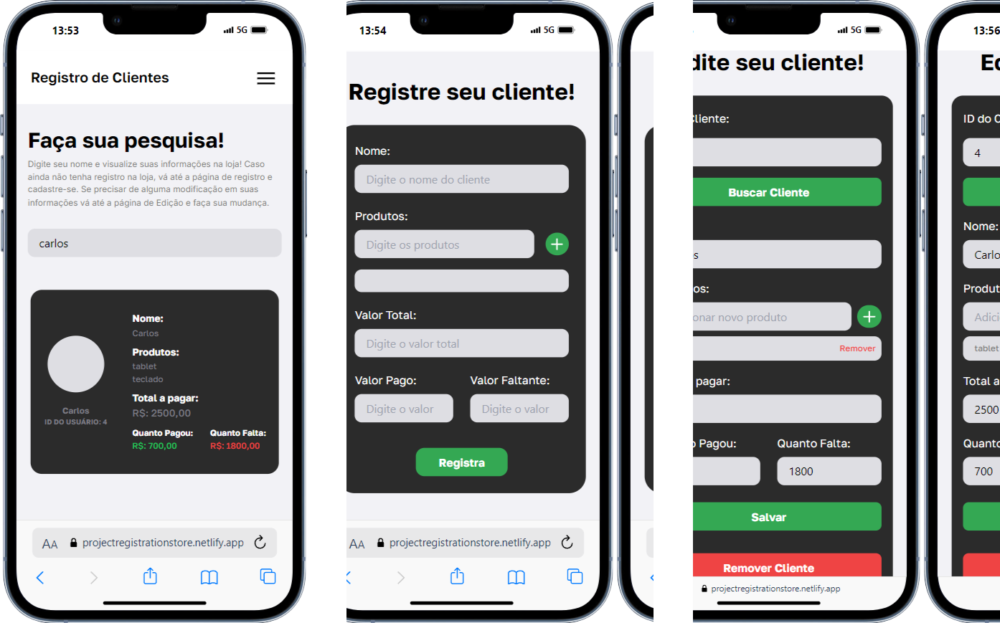
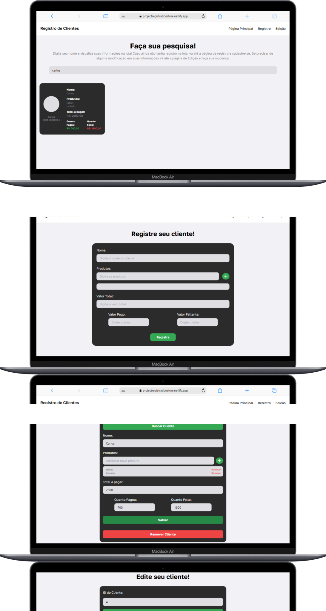

# **StoreRegistration**
StoreRegistration é um projeto React desenvolvido para o registro e manutenção de informações de clientes. O sistema é direcionado a pequenas empresas que precisam de uma solução prática para visualizar, registrar e editar facilmente os dados de seus clientes. Esta aplicação foi construída utilizando React.js para o frontend e Node.js para o backend.
<hr/>

<h2><a href='https://projectregistrationstore.netlify.app/
'>Clique aqui para visitar o site</a></h2>

<hr/>

## Índice
1. [Visão Geral](#visão-geral)
2. [Tecnologias](#tecnologias)
3. [Uso](#uso)
4. [Instalação](#instalação)
5. [Autor](#autor)
6. [Licença](#licença)

---

## Visão Geral
O StoreRegistration surgiu da observação de um problema comum que eu acompanhava de perto. Alguns amigos que têm seus próprios negócios ainda utilizavam métodos bastante antiquados, como anotar dívidas e informações de clientes em cadernos (risos). Daí veio a ideia: por que não criar um sistema que faça a transição do “caderno da idade da pedra” para o mundo digital atual? A proposta era transformar esse caderno em um sistema onde fosse possível cadastrar, editar e visualizar facilmente as informações dos clientes apenas digitando o nome.

Com isso em mente, comecei a pensar em uma solução que fosse limpa e de fácil acesso. Decidi utilizar React.js para o frontend e Node.js para o backend, tecnologias com as quais já estou familiarizado. Assim nasceu o StoreRegistration! Ainda há muitas melhorias a serem feitas, como a integração com um banco de dados e a adição de novas funcionalidades, mas o sistema já está funcionando de forma prática. Atualmente, as informações são temporárias para evitar sobrecarga na API.

---

## Tecnologias
- **React.js** - Biblioteca JavaScript para a criação da interface de usuário.
- **Node.js** - Plataforma JavaScript para o desenvolvimento do back-end.
- **Express** - Framework para construção de APIs no Node.js.
- **API Própria** - Desenvolvida para o gerenciamento de dados dos clientes.
- **React Router** - Biblioteca para navegação entre páginas no React.
- **Axios** - Cliente HTTP para realizar requisições de APIs.
- **Tailwind CSS** - Framework CSS para design responsivo e estilização rápida.
- **Figma** - Utilizado para o design e prototipação da interface.
- **Vite** - Ferramenta de construção rápida e otimizada para desenvolvimento frontend.

---

## Uso

### Interface
A interface é projetada para ser simples e fácil de usar, com apenas três páginas principais:

1. **Página Principal**: Exibe todas as informações dos clientes de forma clara e organizada, permitindo fácil consulta.
2. **Página de Registro**: Facilita o cadastro de novos clientes, oferecendo um formulário intuitivo para preencher os dados necessários.
3. **Página de Edição**: Permite editar qualquer informação dos clientes cadastrados, garantindo que as atualizações sejam rápidas e precisas.

O projeto é completamente responsivo, adaptando-se perfeitamente a qualquer dispositivo, seja desktop, tablet ou smartphone, para uma experiência consistente e agradável. 

Abaixo, confira algumas capturas de tela do projeto em diferentes dispositivos.

</img>
</img>

### Código

O sistema é projetado exclusivamente para a web, utilizando principalmente **React** para o frontend e **Node.js** para o backend. Um dos principais diferenciais é a integração com uma API própria, desenvolvida por mim usando **Express**. A API suporta os métodos **GET**, **POST**, **PUT**, e **DELETE**, possibilitando uma ampla gama de funcionalidades para o site.

Atualmente, as informações cadastradas e modificadas são temporárias, já que o sistema ainda não está integrado a um banco de dados. No entanto, todas as funcionalidades estão totalmente operacionais, garantindo o uso adequado para testes e demonstrações.

## Instalação
Siga os passos abaixo para instalar e rodar o projeto localmente:

### Pré-requisitos
- Node.js (versão recomendada: 14.x ou superior)
- npm ou Yarn (gerenciador de pacotes, normalmente instalado junto com o Node.js)

### Passo a Passo

1. **Clone este repositório:**
   ```bash
   git clone https://github.com/VictorBrasileiroo/ProjectRegistration.git
   ```

2. **Clone este repositório:**
   ```bash
   cd ProjectRegistration
   ```

## Autor
| Nome | Email | Curso | Área
|----------|----------|----------|----------|
| Victor Brasileiro  | valb1@ic.ufal.br | Ciência da Computação | Desenvolvedor React.JS

## Licença
Este projeto está licenciado sob a licença MIT. Consulte o arquivo LICENSE para mais detalhes.


